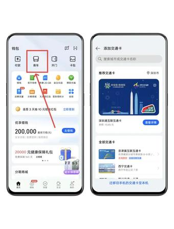
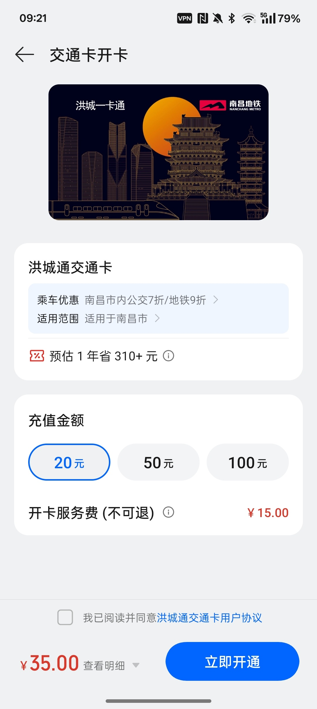

# 儿童团和赤卫队的功用 - 豆包 (16 消息)

🔗 **原始链接**: [https://www.doubao.com/chat/38434531155478786](https://www.doubao.com/chat/38434531155478786)
📅 **导出时间**: 2026年7月12日 22:26:37

---

## 👤 用户
*🕐 2026年7月12日 22:26:37 | #1 | 轮次 1*

> 儿童团和赤卫队 的功用

---

## 🤖 doubao
*🕐 2026年7月12日 22:26:37 | #2*

# 赤卫队、儿童团的设立功用（土地革命时期苏区武装群众组织）

## 一、赤卫队（成年群众武装，核心基层防卫力量）

### 1\. 军事防卫功能

1.  警戒放哨、盘查路人，把守村口、要道，防范白军、地主武装、特务偷袭；
2.  配合红军作战：运送弹药、担架救护伤员、构筑工事、牵制敌军、打扫战场；
3.  清剿本地土匪、还乡团、反动民团，维护乡村治安。

### 2\. 参军支前

动员青壮年参加红军，组织粮食、衣物、草鞋等物资筹集，保障前线供给。

### 3\. 政权维稳

镇压反革命、监视土豪劣绅，协助苏维埃政府分田地、催收公粮，巩固红色基层政权。

### 4\. 后备兵源

作为红军预备役，定期军事训练，红军扩红时直接整队补充主力部队。

## 二、儿童团（少年儿童组织，红色后备培育组织）

### 1\. 辅助警戒、情报传递

年纪小不易被敌人警惕，负责村口、山路放哨查路条，秘密传递情报、送信联络。

### 2\. 宣传动员

书写标语、传唱革命歌谣、向群众宣讲革命道理，动员家人支援红军。

### 3\. 后勤辅助

帮红军洗衣、看护伤病员、看管缴获物资、放牛割草、优待红军家属。

### 4\. 思想培育（核心长期功用）

对少年开展阶级教育、革命教育，培养革命接班人，树立拥军拥政观念； 学习识字、简单军事常识，从小建立革命意识，长大加入赤卫队、红军。

### 5\. 监督协助

监视可疑人员，监督地主、反动分子动向，配合赤卫队开展基层清查工作。

## 三、二者分工配合总作用

1.  **分层防卫体系**：赤卫队扛枪正面防卫、作战；儿童团隐蔽侦查、辅助勤务，老少结合构建乡村红色防线；
2.  **全民战争动员**：覆盖成年、少年，实现苏区全民皆兵，支撑红军长期游击与反 “围剿”；
3.  **巩固苏维埃根基**：武装维稳 + 思想教化双管齐下，保障土地革命政策落地；
4.  **革命人才梯队**：儿童团成长后加入赤卫队，赤卫队优秀者升入红军，形成完整兵员输送链条。

---

## 👤 用户
*🕐 2026年7月12日 22:26:37 | #3 | 轮次 2*

> 井冈山上苏区吗

---

## 🤖 doubao
*🕐 2026年7月12日 22:26:37 | #4*

# 井冈山是苏区，准确说是**井冈山革命根据地**，是全国第一块农村革命根据地，属于早期核心苏区

## 一、定性区分

1.  **根据地**：1927 年 10 月毛泽东率秋收起义部队上井冈山，开辟井冈山革命根据地，是工农武装割据起点；
2.  **苏区**：“苏区” 全称**苏维埃区域**，指建立了苏维埃工农政权、实行土地革命的区域。 井冈山根据地 1928 年成立**湘赣边界工农兵苏维埃政府**，有完整苏维埃政权、分田运动、赤卫队、儿童团、红军，**完全属于苏区**，后世统称**湘赣苏区**的源头。

## 二、井冈山苏区的配套组织（对应你刚才问的赤卫队、儿童团）

1.  武装体系：主力是红四军；地方武装为**赤卫队、暴动队**；少年组织**儿童团**；
2.  政权：乡、区、县三级苏维埃政府，开展打土豪、分田地；
3.  功能：农村包围城市的样板，各地后续赣南闽西中央苏区、湘鄂西苏区都借鉴井冈山模式。

## 三、补充小知识点

狭义 “中央苏区” 专指赣南、闽西，但井冈山属于**湘赣苏区**，是最早的红色苏区，是中央苏区的重要战略屏障与源头根据地。

---

## 👤 用户
*🕐 2026年7月12日 22:26:37 | #5 | 轮次 3*

> 一加手机添加公交卡

---

## 🤖 doubao
*🕐 2026年7月12日 22:26:37 | #6*

# 一加手机添加 NFC 公交卡完整教程（ColorOS / 一加全机型通用）

## 一、前期准备

1.  **确认硬件**：一加数字系列、Ace 系列国内国行机型均带全功能 NFC；海外氧 OS 无交通卡功能。
2.  **开启 NFC**打开「设置 → 连接与共享」，打开**NFC**；触碰付款默认应用选择「钱包」，避免刷卡跳转微信 / 支付宝。
3.  **更新软件**：应用商店更新「一加钱包 / OPPO 钱包」到最新版，系统升级至最新 ColorOS。

## 二、开通全新虚拟公交卡（最常用）

1.  打开桌面自带**钱包**APP，首页点击【去乘车 / 交通卡】
2.  点击「添加交通卡」，搜索城市名称，两种卡可选：
    
    -   本地城市卡：本地公交地铁折扣最全（如洪城一卡通・南昌）
    -   交通联合卡：全国 300 + 城市通用，异地无本地优惠
    
3.  阅读协议并同意，支付**开卡费**（常有 0 元开卡活动，部分卡押金可退）
4.  选择充值金额（最低 10 元），微信 / 支付宝支付，等待 1 分钟写入卡片
5.  完成，卡片存入「我的交通卡」

## 三、实体公交卡移卡（把实体卡余额转到手机）

1.  钱包→添加交通卡→选择「实体卡迁移」
2.  将实体公交卡紧贴手机背部 NFC 感应区（摄像头附近）
3.  读取卡片信息，验证信息后支付手续费，实体卡余额转入手机

> 注意：迁移后实体卡会失效；学生卡、老年优惠卡大多不支持迁移。

## 四、刷卡使用方法

1.  **息屏直接刷**（无需解锁、不用打开 APP），手机背部贴近公交 / 地铁读卡器
2.  手机关机低电量仍可刷卡（断电后支持 6 小时左右离线刷卡）
3.  多卡设置：钱包交通卡页面设**默认卡**，刷卡优先扣选定卡片

## 五、南昌本地补充（你所在城市）

可选「洪城一卡通」本地卡，南昌公交、地铁享受实体卡同等折扣； 也可开通全国交通联合卡，外出其他城市通用。

## 六、常见问题

1.  刷卡没反应
    
    -   确认 NFC 开启、默认付款应用是钱包；手机壳太厚取下；对准背部摄像头位置。
    
2.  找不到交通卡入口
    
    -   国行 ColorOS 才有，海外氧 OS 不支持；更新钱包 APP。
    
3.  开卡失败
    
    -   切换 Wi‑Fi / 流量，清理钱包缓存，重启手机重试。
    
4.  退款退卡 钱包 - 交通卡详情页，找到退卡入口，余额扣除手续费原路返还。

相关视频

NFC

一加手机全功能NFC，出行乘车真方便#一加11 #一加ace2 #一加

使用一加手机的NFC功能，碰一下手机即可刷公交乘地铁，没电没网也能用哦！#一加手机 #一加甘肃

全功能NFC能做些什么?#一加11 #手机NFC

---

## 👤 用户
*🕐 2026年7月12日 22:26:37 | #7 | 轮次 4*

> 这个要 15 元

---

## 🤖 doubao
*🕐 2026年7月12日 22:26:37 | #8*

## 一、15 元是什么费用（一加 / OPPO 钱包洪城一卡通）

这 15 元是**一次性不可退开卡服务费**，不是押金黑猫投诉：

1.  实体洪城普通卡 15 元是押金，线下营业厅可退；
2.  手机 NFC 虚拟洪城一卡通的 15 元属于平台技术服务费，开卡页面会标注**不予退还**，线上退卡只能取回卡内充值余额，15 元不会返还。

## 二、两种方案对比，省钱选择

### 方案 1：本地洪城一卡通（15 元开卡费，不退）

✅ 优势：南昌公交 7 折、地铁 9 折、1 小时换乘优惠，本地折扣最全 ❌ 缺点：15 元一次性花费；换不同品牌手机无法迁移，换机要重新花 15 元开卡

### 方案 2：全国交通联合卡（无开卡费，推荐）

✅ 优势：0 元开卡，全国三百多城市公交地铁通用；卡可随账号迁移，换机不用重开 ❌ 缺点：外地能用，但**南昌地铁无 9 折优惠**，只有公交基础折扣，没有换乘减免

## 三、省钱小技巧

1.  先看钱包首页活动：经常有限时**0 元开洪城一卡通**活动，蹲活动再开能省 15 元；
2.  日常只坐公交、很少坐地铁：直接开**交通联合卡**，完全不用掏 15 元；
3.  每天地铁通勤、看重换乘优惠：只能选洪城本地卡，接受 15 元一次性成本。

## 四、补充退费说明

后续不用卡时：钱包内注销卡片，**充值余额原路退回**，但 15 元开卡服务费永久不退，洪城一卡通官方对此有明确规则黑猫投诉。

---

## 👤 用户
*🕐 2026年7月12日 22:26:37 | #9 | 轮次 5*

> 

---

## 🤖 doubao
*🕐 2026年7月12日 22:26:37 | #10*

### 界面细节解读📌

这是一加（搭载 ColorOS 钱包）开通南昌**洪城一卡通**虚拟卡的页面，总价 35 元的构成拆解： 充值 20 元（存入卡内可乘车消费） + 不可退还的开卡服务费 15 元 = 合计 35 元

#### 权益亮点

1.  本地专属优惠：南昌市公交享 7 折、地铁享 9 折，同时适配南昌本地公交换乘减免政策，页面标注一年预估可以省下 310 元以上，日常通勤频次偏高的话，15 元的开卡成本很快就能被优惠抵扣回来。
2.  使用便利性：手机 NFC 息屏即可刷卡，不用掏出实体卡片，低电量短时也支持离线刷码通行。

---

### 决策参考⚠️

#### 适合付费开通的情况

日常长期在南昌通勤，经常乘坐地铁 + 公交，在意本地专属折扣、换乘福利，选这张卡性价比很不错。

#### 可以备选其他方案的情况

1.  偶尔才在南昌出行：可以选择钱包里的**全国交通联合卡**，大多免去 15 元开卡费，缺点是南昌地铁拿不到 9 折优惠；
2.  在意 15 元无法退款这一点：可以时常留意钱包活动，平台不定期放出洪城一卡通 0 元开卡的限时福利，等待活动再开通就能省下这笔服务费。

### 操作小提示

正式开通前必须勾选「我已阅读并同意洪城交通卡用户协议」，才可点击下方蓝色的立即开通按钮；后续如果不想继续使用卡片，仅能够退回卡内剩下的充值余额，前期缴纳的 15 元服务费不会返还。

### 实操小贴士💡

开卡完毕之后建议进入钱包设置，把这张洪城交通卡设置成默认交通卡，日常刷卡就不会出现唤起其他付款方式的情况；刷卡感应位置对准一加手机背部靠近摄像头的 NFC 区域，太厚的手机壳建议取下，提升刷卡的成功率。

---

## 👤 用户
*🕐 2026年7月12日 22:26:37 | #11 | 轮次 6*

> 怎么免费

---

## 🤖 doubao
*🕐 2026年7月12日 22:26:37 | #12*

# 洪城一卡通免除 15 元开卡费的可行方案（一加 / OPPO 钱包适配）

## 方案一：蹲官方限时 0 元开卡活动（最正统，拿到本地专属优惠）💡

### 活动获取渠道

1.  **钱包 App 内部活动**打开 OPPO 钱包（一加原生适配）首页，留意首页 banner、乘车板块弹窗、活动专区，节假日、开学季、南昌本地出行节点经常会放出洪城一卡通**减免 15 元开卡服务费**的限时券，活动生效之后原本不可退的 15 元费用直接免除，仅需要充值最低 20 元车费即可开卡南昌本地宝。小细节：把手机定位锁定南昌，异地定位一般不会推送本地开卡福利。
2.  **官方公众号蹲活动** 关注「洪城一卡通」官方公众号、「OPPO 钱包」公众号，新活动会提前预告，偶尔还会社区限量发放开卡优惠券。
3.  **一加社区留意专属福利** 浏览一加官方社区江西板块，手机厂商区域活动有时会投放本地公交开卡专属免单福利一加社区。

### 活动小技巧

-   钱包开启消息推送，开卡优惠上线能够及时收到推送；
-   大促节点优先级：寒暑假开学时段、五一 / 国庆、南昌本地文旅活动期间，活动概率最高。

## 方案二：选择全国交通联合卡，永久规避 15 元开卡费（立刻就能操作，不用等待活动）✅

### 操作步骤

1.  钱包点击添加交通卡，不挑选「洪城通交通卡」，转而搜索**全国交通联合一卡通**；
2.  该类卡片日常大多 0 服务费开卡，无需支付那笔 15 元不可退费用；

### 利弊权衡

优势：免去一次性开销、卡片跟随 OPPO 账号迁移，后续更换一加手机不需要重新付费开卡，国内三百多城市都能刷卡； 短板：在南昌仅公交可以享受折扣，地铁没法拿到洪城一卡通专属 9 折，同时无法享受南昌 1 小时换乘减免政策，通勤地铁频次高就不太划算。

## 方案三：线下办理实体卡做替代（线下场景可选）📌

前往洪城一卡通线下自营网点办理实体卡片，线下实体的 15 元属于可退还押金，后续不用卡片前往线下网点就能够拿回押金，区别在于日常需要随身携带实体卡，不能实现手机一碰刷卡。

## 不推荐的踩坑提醒⚠️

1.  不要网购第三方号称 “破解免 15 开卡费” 的教程、代开服务，NFC 虚拟卡绑定手机账号，第三方操作极易造成账号封禁、资金隐患；
2.  小程序、支付宝、微信端的乘车码不属于 NFC 公交卡，二者体系独立，没法用来抵扣钱包这边 NFC 洪城一卡通的开卡服务费。

## 选择建议参考

1.  地铁通勤每周≥3 次：耐心蹲钱包官方免开卡活动，后续本地优惠省下的车费很快覆盖成本；
2.  平时基本只搭乘公交、出行频次一般：直接开通 0 元的交通联合卡当下就能够省下 15 元；
3.  不习惯手机刷卡：线下办理押金可退的实体洪城一卡通。

---

## 👤 用户
*🕐 2026年7月12日 22:26:37 | #13 | 轮次 7*

> Google 的钱包有这个功能吗

---

## 🤖 doubao
*🕐 2026年7月12日 22:26:37 | #14*

### 结论先行：Google 钱包（Google Wallet）**没法用来添加南昌洪城一卡通**，无法借此规避那 15 元开卡费，下面详细拆解原因：

#### 一、地域层面的硬性限制⚠️

1.  Google Wallet 官方落地服务区域不包含中国大陆内地电子发烧友...。国行一加手机出厂就没有预装完整谷歌 GMS 服务框架，就算手动自行安装谷歌套件，也无法解锁内地交通卡的空中发卡权限。
2.  谷歌钱包对接的公交卡均是海外区域的票卡，比如日本 Suica 西瓜卡、英国 Oyster 卡、中国台湾 iPass 一卡通等，**至今没有接入洪城一卡通、内地任意城市本地市政公交卡**iPASS...。

#### 二、合作生态层面的壁垒📌

国内城市 NFC 公交卡，都需要当地一卡通公司和手机厂商（OPPO / 一加、小米、华为、苹果）单独开展适配合作，做本地化的密钥、发卡体系对接：

-   洪城一卡通目前完成适配的只有 OPPO 钱包（也就是你一加手机自带的钱包）、小米 Pay、华为 Pay、Apple Pay 这几个国内主流手机钱包渠道问政江西；
-   洪城一卡通官方没有和 Google Wallet 签署适配合作，谷歌钱包列表搜不到洪城一卡通，自然无法开通这张卡。

#### 三、两个常见误区澄清

1.  即便你拥有海外版一加手机、成功部署谷歌全套服务，也仅能够添加海外当地公交卡，依旧找不到南昌洪城一卡通；
2.  Google 钱包能够绑定境外银行卡进行海外线下刷卡，但这属于银行卡闪付范畴，不等同开通本地市政公交 NFC 卡，二者体系完全独立。

#### 四、你当下可行的替代选择回顾

1.  继续使用一加自带的 OPPO 钱包，等候官方限时 0 开卡费活动；
2.  在 OPPO 钱包开通**全国交通联合卡**，直接免除 15 元服务费；
3.  线下网点办理押金可退的实体洪城一卡通。

#### 补充小细节

唯一例外场景：你前往海外定居出行，Google 钱包才会发挥添加当地公交卡的优势；日常在南昌通勤，谷歌钱包没有适配价值。

---

## 👤 用户
*🕐 2026年7月12日 22:26:37 | #15 | 轮次 8*

> 一加只能用软件打九折吗

---

## 🤖 doubao
*🕐 2026年7月12日 22:26:37 | #16*

# 详细解答：一加手机拿南昌地铁常态化 9 折，并非只有这一种软件方式，下面分常规固定折扣、临时活动优惠两大板块梳理

## 一、常态化永久地铁 9 折（日常稳定生效）

### 方式 1：一加自带 OPPO 钱包开通 NFC 洪城一卡通（你现在看到的方案）

需要支付 15 元不可退开卡服务费，息屏一碰就可刷卡，固定地铁 9 折、公交 7 折，还能享受官方 1 小时换乘减免福利wenz.jxnew...。

### 方式 2：线下实体洪城一卡通

线下线下网点办理实体普通卡，15 元属于**可退还押金**，不用卡时前往线下网点就能拿回押金，刷卡享受一模一样的地铁 9 折、公交 7 折、换乘优惠，一加手机 NFC 后续也能把这张实体卡迁移录入手机（迁移有条件限制，老年卡、学生优惠卡不可迁移）wenz.jxnew...。

### 重要排除说明

1.  支付宝、微信、鹭鹭行扫码、交通联合 NFC 虚拟卡**拿不到日常固定 9 折**：扫码乘车原价计费；全国交通联合虚拟卡在南昌地铁无常规 9 折福利，公交才可打折一加社区；
2.  Google 钱包无法适配洪城一卡通，彻底排除这个途径。

## 二、临时性优惠（不定期活动，折扣力度常常优于 9 折）

借助一加手机安装各类 APP 也可以拿到更低折扣，优惠不是长期固定，会随活动周期变化：

1.  **鹭鹭行专属活动**：绑定指定第三代社保卡，活动时段最低做到地铁 6 折，存在每月、每日乘车次数上限约束南昌本地宝；
2.  **云闪付、支付宝周期性福利**：日常发放地铁立减券、周末专属折扣、商圈出行礼包，偶尔折扣优于 9 折，优惠额度每期更新；近期 7.1-10.8 每晚 21 点之后，依托鹭鹭行体系的多款扫码渠道可以免费搭乘地铁，短期福利力度极强南昌轨道交...；
3.  各类银行 APP（建行生活、农行 APP 等）也会阶段性放出地铁乘车立减活动。

## 三、方案对比 & 选择建议

表格

| 方案 | 稳定 9 折 | 15 元费用属性 | 便利性 | 限制点 |
| --- | --- | --- | --- | --- |
| 一加钱包 NFC 洪城虚拟卡 | ✅稳定享受 | 服务费不可退 | 最高，息屏 NFC 刷卡 | 一次性支出 15 元 |
| 线下实体洪城一卡通 | ✅稳定享受 | 15 元押金可退 | 偏低，日常需要携带卡片 | 容易弄丢卡片 |
| 各类扫码 APP（鹭鹭行 / 支付宝等） | ❌常态没有 9 折，仅活动期降价 | 无前置开卡开销 | 中等，需要打开调出乘车码 | 优惠存在有效期、次数上限 |
| 交通联合 NFC 卡 | ❌地铁无固定 9 折 | 多数免开卡费 | 高 | 地铁原价计费 |

## 实操建议

1.  如果想要**长年稳定保持地铁 9 折**：不想花不可退的 15 元，优先线下办理实体洪城一卡通；能接受一次性 15 元开销，就等待一加钱包 0 元开卡活动上线再开通虚拟卡；
2.  日常地铁频次不高、想要节省前期开卡成本：日常使用鹭鹭行、云闪付、支付宝扫码，蹲平台阶段性活动折扣即可；眼下 21 点后的免费乘车活动就可以充分利用。

### 补充小细节

洪城一卡通自家 APP 出的二维码仅公交享受折扣，地铁扫码依旧原价，这点要留意避开误区wenz.jxnew...。

---

*由 [NousSave Ai Chat Exporter](https://www.noussave.com) 生成 | doubao | 2026/7/12*
